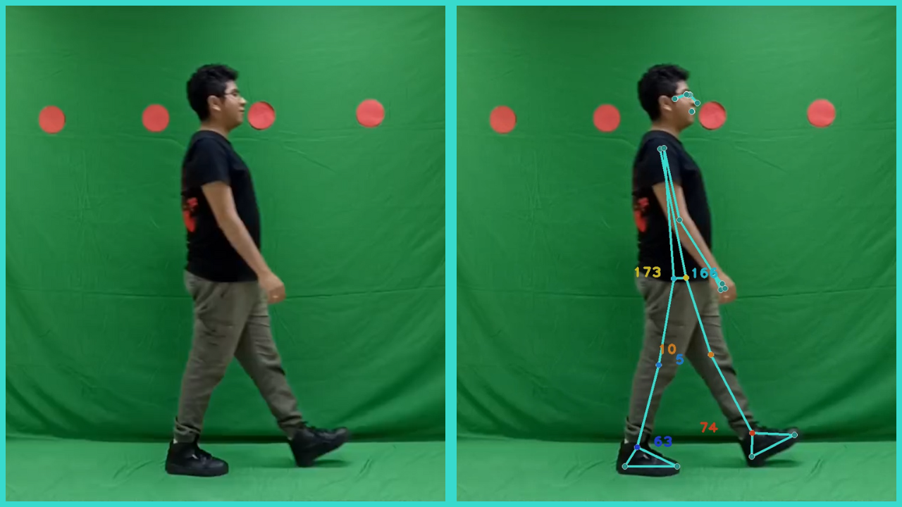
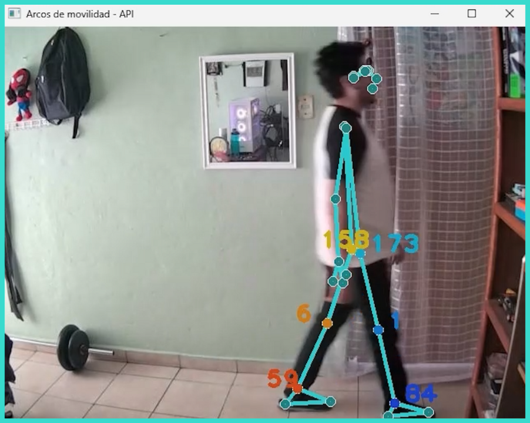
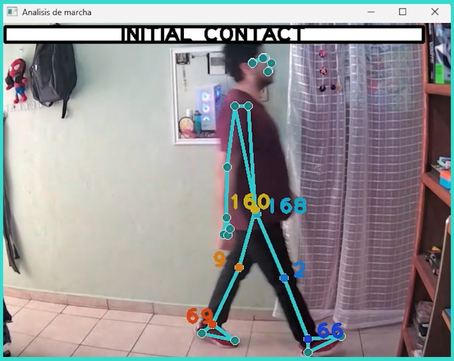

# Un nuevo enfoque para la evaluación de la marcha humana mediante visión computacional y dispositivos portátiles de medición inercial

Herramienta automatizada para el análisis de la marcha humana que combina sensores inerciales y visión por computadora para estimar el rango de movimiento, 
detectar fases del ciclo de la marcha y facilitar diagnósticos clínicos mediante una interfaz intuitiva.

## Tabla de Contenidos

- [Descripción](#descripción)
- [Estructura de Carpetas](#estructura-de-carpetas)
- [Uso Visión Computacional](#uso-visión-computacional)
  - [Estatico](#estatico)
  - [TiempoReal](#tiemporeal)
  - [Video](#video)
- [Uso Sensores](#uso-sensores)
- [Uso Interfaz](#uso-interfaz)

## Descripción

Este proyecto propone una herramienta automatizada para el análisis preciso de la marcha humana, combinando sensores inerciales y visión computacional. 
El objetivo es superar las limitaciones de los métodos tradicionales (como el alto costo, la baja precisión y el tiempo requerido) mediante un sistema que integra tecnologías modernas y algoritmos de aprendizaje automático.

Los datos son recolectados mediante unidades de medición inercial (IMU) conectadas por Bluetooth, que estiman automáticamente parámetros clave como el rango de movimiento, velocidad, longitud del paso, ciclo de la marcha y cadencia. 
Simultáneamente, se procesan fotogramas de video para extraer las posiciones del tren inferior utilizando redes neuronales convolucionales. 

Esta información se emplea en una segunda estimación de arcos de movilidad, además de realizar predicciones sobre las fases de la marcha humana mediante modelos de machine learning entrenados con una base de datos de aproximadamente 
2,300 imágenes de adultos sanos de entre 20 y 25 años. El sistema identifica las 8 etapas del ciclo de la marcha con una precisión notable, alcanzando un F1 Score mínimo de 0.89 para la fase de "Oscilación Media" y un máximo de 0.96 para 
"Apoyo Medio", con una precisión global de 0.94. 

Ambas estimaciones se combinan para reducir la incertidumbre de las mediciones individuales. Finalmente, los resultados se presentan mediante una interfaz gráfica intuitiva que permite a profesionales de la salud acceder a herramientas de 
diagnóstico de bajo costo y alta precisión.

## Estructura de Carpetas

Explicación de la estructura de carpetas del repositorio:

- `/SensoresInerciales`: Pendiente.

- `/VisionComputacional`: Códigos con diferentes métodos de captura sobre visión computacional.
  - `/Estatico`: Estimación de arcos de movilidad en imágenes.
  - `/ModelosML`: Modelos preentrenados de ML junto con los scalers.
  - `/Pruebas`: Videos e imágenes que funcionan para probar los algoritmos.
  - `/TiempoReal`: Estimación de Arcos y predicción de fases de la marcha en tiempo real.
  - `/Video`: Estimación de arcos y predicción de fases de la marcha en un video pregrabado.

- `/Interfaz`: Pendiente.

## Uso Visión Computacional

Como se mencionó anteriormente, este apartado se divide en diferentes carpetas de las cuales nos enfocaremos en Estatico, TiempoReal y
Video. Empezaremos con el código de la API contenida en la primer carpeta;

### Estatico

En esta carpeta se encuentra el algoritmo `APIImagen.py`, en términos sencillos, la API recibe una imagen como entrada, detecta los puntos del cuerpo mediante mediapipe, estima los arcos de movimiento de puntos en cadera, rodilla y talón para dar como salida una imagen procesada que muestra los ángulos en colores intuitivos.

Para ejecutar la API es recomendable que se utilice una terminal; colóquese en el directorio de NEMI y ejecute el comando: `uvicorn VisionComputacional.Estatico.APIImagen:app`, esto le permitirá recibir imágenes y mandar la imagen codificada.
   
Esta API se utiliza también en el código: `VisionComputacional/TiempoReal/PruebasAPI.py`, el cual se describe a continuación.

### TiempoReal

En esta carpeta existen 3 códigos principales con diferentes métodos para hacer mediciones en tiempo real, todos se ven afectados en cierta medida por el gasto computacional, por lo que es importante tomar en cuenta la situación en que se utilizarán.

#### PruebasAPI.py

Comencemos con el código `PruebasAPI.py`, este es un ejemplo de como se podría utilizar la API en `VisionComputacional/Estatico/APIImagen.py`; Este algoritmo accede a la cámara principal de la computadora que se esté utilizando y manda las imágenes obtenidas para ser procesadas en la API y, al terminar el procesamiento, son mostradas en tiempo real. 

Como primer paso se tiene que ejecutar la API como se mostró en la subsección anterior y después ejecutar el código de python. Es importante destacar que la fluidez y el delay del video pueden verse afectada por la calidad de conexión, el tamaño de la captura de imágenes que se utilice, entre otras cosas.

#### AproximacionDeArcos.py

Este código funciona similar al anterior, accediendo a la cámara del usuario para obtener imágenes, procesarlas con ayuda de mediapipe y haciendo la estimación de los ángulos, su principal diferencia radica en que todo este proceso es local, por lo que disminuye el delay respecto a la API.

Este código no requiere de otro para ser ejecutado. Una vez en uso la ventana abierta por opencv donde se muestran los resultados puede ser cerrada presionando la tecla `ESC`.

#### ArcosYEtapas

Este algoritmo se enfoca en agregar una nueva funcionalidad a los algoritmos anteriores, además de poder hacer la estimación de arcos en tiempo real, con ayuda de estos datos y los datos de posición de puntos importantes se utiliza un algoritmo de Machine Learning contenido en la carpeta `VisionComputacional/ModelosML` para poder clasificar la fase de la marcha en la que se encuentra la persona (CONTACTO INICIAL": "INITIAL CONTACT", "RESPUESTA A LA CARGA": "LOADING RESPONSE", "APOYO MEDIO": "MID-STANCE", "APOYO FINAL": "TERMINAL STANCE", "PRE OSCILACION": "PRE-SWING", "OSCILACION INICIAL": "INITIAL SWING", "OSCILACION MEDIA": "MID-SWING", "OSCILACION FINAL": "TERMINAL SWING").

Como el algoritmo anterior, no requiere de algo más para ser ejecutado y la ventana abierta por opencv se cierra con la misma tecla `ESC`.  Si se desea utilizar los nombres en español de las etapas es necesario cambiar el diccionario de `mapa_etiquetas` encontrado en el código.

### Video

Esta carpeta contiene algoritmos que funcionan con videos grabados anteriormente, surge con la finalidad de eliminar los posibles errores provocados por el gasto computacional de ejecutar los algoritmos en tiempo real.

#### ArcosYPredicciones.py

Este es un algoritmo que toma como entrada un video, en este caso está configurado para utilizar el video de `VisionComputacional/Pruebas/Gait.mp4`, aunque el código puede ser modificado para procesar otro. El proceso se basa en crear un nuevo video que muestra los ángulos estimados de miembros inferiores, así como las etapas predecidas por el algoritmo de machine learning de la carpeta `VisionComputacional/ModelosML`. Para poder tener una idea del proceso, también se muestra en la terminal o en donde se ejecute el código de python la cantidad de frames procesados y un porcentaje cada que este aumente un 5%. Como añadido a los anteriores algoritmos, este nos permite obtener al final obtener un archivo csv con la información del video, es decir, los arcos de movilidad, tiempos y la predicción de la etapa de la marcha.

Este código no requiere de ejecutar algo más, simplemente con tener una entrada de video junto con los algoritmos preentrenados del scaler y el modelo de ML funciona. Se puede modificar el nombre del video de salida y el archivo csv en el algoritmo así como el destino de estos, si no se modifica el algoritmo guardará tanto el video como el csv en la carpeta `VisionComputacional/Pruebas`.

#### APIVideo.py

Esta API cuenta con distintos apartados para hacer funcionar correctamente todo lo que se mencionó en el algoritmo anterior; El primer apartado es en el que se puede subir y procesar el video, tiene como salida tanto el csv como el video con estimaciones de arcos y la predicción de las etapas de la marcha. Para descargar estos dos también se guarda el número serial generado en carpetas temporales por ambos, así entonces, con el segundo y tercer apartado se pueden extraer para poder guardarse en la computadora. Finalmente existe otro apartado para eliminar los archivos temporales y poder empezar desde cero los procesos.

Esta API se puede ejecutar utilizando una terminal con el comando `uvicorn VisionComputacional.Video.APIVideo:app`, esto le permitirá subir videos, descargar las salidas y reiniciar el programa en interfaces como Swagger o utilizando un programa como el que se mostrará a continuación.

#### PruebaAPI.py

En este algoritmo se utiliza la API mencionada anteriormente, solamente requiere el archivo de entrada para descargar automáticamente las salidas (el video procesado y el archivo csv), si no se configura un nombre o ruta de destino diferente las salidas se encontrarán en la carpeta `VisionComputacional/Pruebas`, como adición en la terminal se mostrará el progreso que lleva el analisis del video por lo que puede revisarse en cualquier momento.

Es claro que para utilizar el código se debe ejecutar el archivo `APIVideo.py` en una terminal con el comando `uvicorn VisionComputacional.Video.APIVideo:app`, después, de ser necesario, se debe cambiar el nombre del archivo de entrada para posteriormente ejecutar el algoritmo y así poder observar las salidas y el progreso.

### Uso Sensores

ESTA SECCIÓN ESTÁ PENDIENTE

### Uso Interfaz

ESTA SECCIÓN ESTÁ PENDIENTE
